# AI-Powered-Insurance-Claims-Triage-System

This project aims to automate the risk triage process for insurance claims using a combination of Large Language Models (LLMs), metadata analysis, and explainable AI. Traditional manual claim triaging is labor-intensive and prone to human bias. By introducing a structured, AI-powered solution, I target faster and more accurate claim classification.

#### Background and Goals
This solution is tailored to address the need for scalable claim triage by leveraging:
- Fine-tuned transformer models like RoBERTa
- Retrieval-Augmented Generation (RAG) pipelines
- Explainable AI tools (LIME/SHAP)
- A DevOps-ready infrastructure for CI/CD and monitoring
- Streamlit based front end for users
  
The goal is to produce a real-time, transparent, and scalable classification engine that categorizes insurance claims into Low, Medium, or High severity/risk.

### Approach
The project is being implemented using a phase-wise development strategy, allowing for modularity, rapid iteration, and effective testing of each component. This structured approach not only accelerates development but also facilitates the integration of MLOps and DevOps pipelines in subsequent stages.

## Phase-Wise Development Plan

### 🔹 Phase 1 – Core Model Development [➡️](#phase-1--core-model-development-claim-severity-classification)  
- Build the core LLM-based classifier using a fine-tuned transformer model like RoBERTa, focused on predicting claim severity based on structured data and claim description.
- Build Streamlit pages for user login, claim upload (single and batch), and management; display model-predicted claim severity using the integrated RoBERTa-based classifier.

### 🔹 Phase 2 – Explainability Integration [➡️](#phase-2-explainability--context-integration)
- Incorporate explainable AI tools to interpret the model’s decisions, offering transparency to reviewers and ensuring regulatory compliance.
- Implement the Explanation page to visualize SHAP and LIME outputs for each prediction, and integrate database connectivity for storing and retrieving user data, claims, predictions, and explanation metadata.

### 🔹 Phase 3 – RAG Pipeline Integration [➡️](#phase-3--shap--lime-integration--api-optimization--ui-visualization)
- Implement Retrieval-Augmented Generation using policy documents. This grounds model decisions in source documentation for traceability and improved performance.
- Enhance the Explanation page to include retrieved policy document excerpts and rationale generated via the RAG pipeline, providing context and traceability behind AI decisions.

### 🔹 Phase 4 – MLOps and DevOps Pipelines
- Integrate model retraining, monitoring, version control (GitHub), and automated deployment mechanisms using tools like MLflow, Docker, and CI/CD pipelines.

<br>

---

<br>


## Phase 1 – Core Model Development: Claim Severity Classification

### 📌 What This Phase Includes

Phase 1 focused on establishing the core functionality of the triage system — from dataset preparation and model training to full-stack integration with the user interface. Key accomplishments include:

- Building a **RoBERTa-based transformer model** fine-tuned on synthetic claim narratives.
- Developing a **Streamlit-based frontend** for user login, claim upload, management, and EDA.
- Creating a modular project structure to support future phases like explainability, RAG, and MLOps.
- Implementing the complete AI prediction loop — user inputs a claim, the model evaluates it, and the frontend displays the severity classification.

### 🎯 Objective  
The objective of Phase 1 implementation of an AI-driven system for triaging insurance claims. The goal is build a claim severity classification engine using a fine-tuned RoBERTa transformer model. The system classifies insurance claims into **Low**, **Medium**, or **High** severity levels based on structured metadata and natural language claim descriptions.

### 📂 Dataset Overview  
The dataset contains **21,691** worker compensation claims with structured metadata and keyword-style injury descriptions.

**Key Columns:**
- **Demographics:** Age, Gender, Marital Status  
- **Employment:** WeeklyRate, HoursWorked, Part/Full Time  
- **Accident Metadata:** DateOfAccident, ReportedDay, AccidentHour  
- **Financials:** InitialCaseEstimate, Incurred  
- **ClaimDescription:** Raw keyword-style descriptions (e.g., "STRUCK SCAFFOLDING STRAIN LOWER BACK")

### 📈 Correlation Analysis

To understand the relationships among structured numerical features, I generated a **correlation heatmap**.

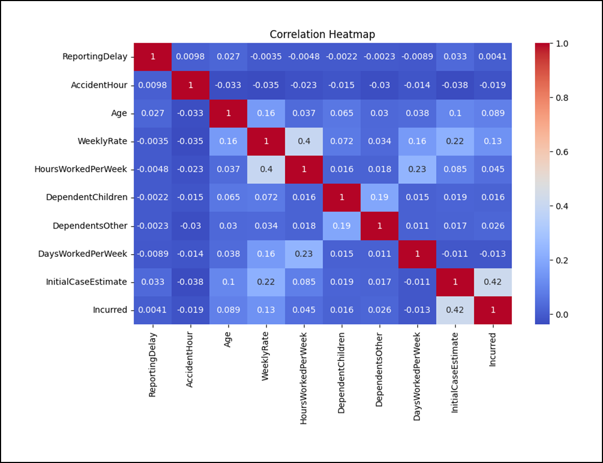

#### 🔍 Key Insights:

- **InitialCaseEstimate vs. Incurred**  
  - **Correlation:** `0.42`  
  - 🟢 *Moderate positive relationship* – higher estimated case values often result in higher final incurred costs.

- **WeeklyRate vs. HoursWorkedPerWeek**  
  - **Correlation:** `0.40`  
  - 🟢 *Suggests workers with longer hours typically earn more weekly.*

- **Low correlations across most other features**  
  - Features such as `ReportingDelay`, `AccidentHour`, and `Dependents` exhibit **minimal linear correlation** with `Incurred`.  
  - 🔍 *This indicates that these features alone are unlikely to reliably predict claim severity.*

> ⚠️ **Conclusion:** Most structured features do not strongly correlate with severity.  
> This justifies the need for **richer natural language inputs** and **advanced models** that can capture complex, non-linear patterns in claims data.

### 🧠 Label Generation: `SeverityLabel`  
To train the model, a target label was created, called `SeverityLabel` by splitting the `Incurred` column (final cost) into **three quantiles**:
- **Low**: Bottom third of incurred cost
- **Medium**: Middle third  
- **High**: Top third  

This ensured class balance and label realism based on actual financial impact.

### 🔄 Data Preprocessing & Augmentation  

#### 1. **Raw to Natural Language (NL) Conversion**
Raw descriptions were transformed into coherent first-person sentences using **Falcon-7B-Instruct**.

Example:  
**Original:** `"STRUCK SCAFFOLDING STRAIN LOWER BACK"`  
**Transformed:** `"I was struck by scaffolding and strained my lower back."` → `DetailedClaimDescription`

#### 2. **InputText Construction**  
Multiple structured fields were combined and the rephrased descriptions into a comprehensive natural language input for RoBERTa.

Example:  
```text
"I’m 28 years old and work full-time. I usually work 44 hours a week. The accident occurred on 5/10/2005. I was struck by a scaffold and strained my lower back."
```

#### 3. **Severity Phrase Injection**  
Severity-specific sentences were appended to `InputText`:
- **Low:** "The injury was minor and did not require much recovery."  
- **Medium:** "The injury was moderate and affected my work temporarily."  
- **High:** "The injury was severe and required extended treatment and rest."

This boosted classification accuracy by making severity cues explicit.

### 🧪 Model Training: RoBERTa

**Model:** `roberta-base`  
**Input:** `InputText`  
**Output:** `SeverityLabel`

**Training Config:**
- Token Length: 256  
- Epochs: 3–5  
- Batch Size: 8  
- Optimizer: AdamW  
- Early Stopping: Enabled  

### 📊 Performance Results

| Model             | Accuracy | F1 Score | Notes                        |
|------------------|----------|----------|------------------------------|
| **RoBERTa**       | ~1.00    | ~1.00    | May overfit due to repetition |
| **XGBoost**       | 0.47     | 0.46     | Best among traditional models |
| **SVM**           | 0.46     | 0.46     | Balanced precision/recall    |
| **Logistic Reg.** | 0.47     | 0.45     | Decent baseline              |
| **Random Forest** | 0.42     | 0.42     | Struggled with complexity    |

### 🧪 Free-Text Testing

To check generalization, RoBERTa was tested on new, unseen natural sentences:

| Custom Input                                                       | Prediction |
|--------------------------------------------------------------------|------------|
| "I got a heart attack"                                             | High       |
| "I twisted my wrist slightly while carrying a box"                | Low        |
| "Machinery injury, bluish and swollen"                            | High       |
| "My friend pulled my hair, I got a headache"                      | Low        |
| "I fractured my right arm and leg in a car accident"              | High       |

Despite possible overfitting, these results show the model can **infer severity from context** in unseen text.

### 🧩 Phase 1 – Front End
The Streamlit frontend was simultaneously developed to serve as the user-facing layer of the system. Users can log in, upload claims (individually or in batch), view predicted severity classifications, and explore trends across demographic variables using the EDA dashboard. A management interface was also implemented to browse through uploaded claims in a paginated table. The complete flow — from claim upload to risk classification — is now functional and ready for real-world validation.

### 📊 Streamlit Pages & Features


### 🔐 Login and Registration

User authentication is handled via a dedicated login and registration module.  
New users can create accounts using the registration form, while existing users can log in securely with their credentials.  
Once authenticated, users are redirected to the system’s landing page, which serves as the gateway to the rest of the interface.  
This setup ensures secure access control and allows user-specific interactions within the system.


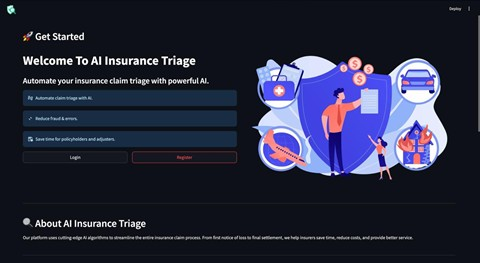

### 📊 EDA Dashboard

The EDA (Exploratory Data Analysis) Dashboard is designed to give users actionable insights into trends and patterns across the dataset of insurance claims.  
It visualizes claims data based on several demographic factors including age, gender, marital status, and employment type (full-time or part-time).  
These visualizations enable decision-makers to better understand the claim distribution and underlying patterns, facilitating data-driven strategies for risk assessment.

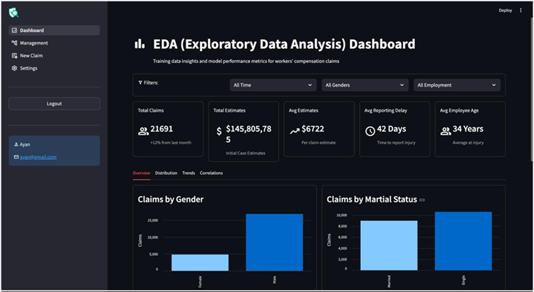

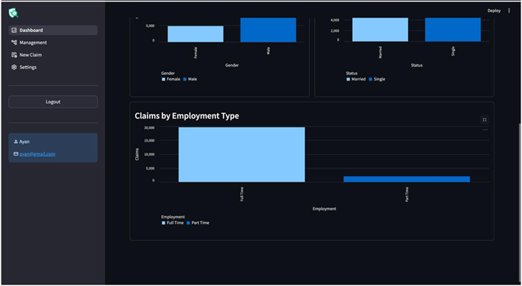

### 📋 Management Page

The Management Page acts as a centralized hub for reviewing all uploaded claims.  
It displays each claim’s details in a tabular format and supports pagination to maintain performance even when handling large datasets.


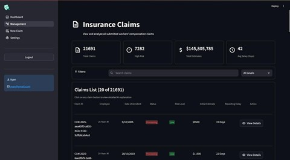


### ⬆️ Claim Upload Page

The Claim Upload Page allows users to introduce new claims into the system.  
This can be done either manually by entering the details of a single claim, or through batch upload by submitting CSV or XLSX files.


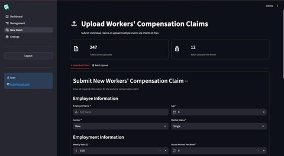


### 🧠 Explanation Page

A key feature of the frontend is the Explanation Page, which provides transparency into the model’s predictions.  
For every claim classified by the LLM (Large Language Model) as **High**, **Medium**, or **Low** risk, the Explanation Page displays a justification.  
This is achieved through **SHAP** (SHapley Additive exPlanations) and **LIME** (Local Interpretable Model-Agnostic Explanations), two industry-standard tools for model interpretability.

### Summary

| Page             | Description                                                                 |
|------------------|-----------------------------------------------------------------------------|
| Login/Register   | Secure user authentication and account management                          |
| Claim Upload     | Upload claims manually or via CSV/XLSX batch files                          |
| Management Page  | Browse uploaded claims and their predicted severities (paginated view)      |
| EDA Dashboard    | Visual insights into claim patterns by age, gender, employment type, etc.   |


<br>


<br>

---

<br>


## Phase 2: Explainability & Context Integration

### 🧠 AI/ML Progress

#### LLM Prediction API (`/predict`)
- Fine-tuned **RoBERTa** serves as the core triage engine
- Accepts enriched claim narratives (`InputText`)
- Returns:
  - Predicted Severity: `Low`, `Medium`, or `High`
  - Confidence Score

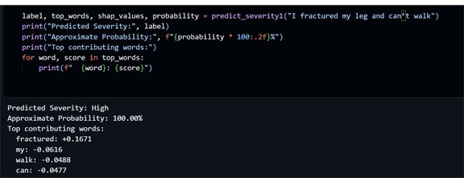

#### SHAP & LIME Explanation API (`/explanation/{claim_id}`)
- Both SHAP and LIME implemented for interpretability
- **SHAP** chosen as default due to:
  - Determinism
  - Semantic token importance
  - Transformer-native support
- Outputs token-level importance highlighting key decision drivers like `fracture`, `bleeding`, etc.


##### 🔬 SHAP vs LIME: Comparison Table

| Aspect             | LIME                                                                 | SHAP                                                          |
|--------------------|----------------------------------------------------------------------|----------------------------------------------------------------|
| **Methodology**     | Perturbation-based; fits a local surrogate model                    | Game theory (Shapley values)                                   |
| **Consistency**     | Varies across runs due to randomness                                | Deterministic (same input yields same output)                  |
| **Speed**           | Slower, especially on long texts                                    | Faster for transformer models                                  |
| **Token Importance**| Sometimes highlights irrelevant tokens                              | Focuses on semantically meaningful tokens                      |
| **Integration**     | Requires manual pipeline adjustment for tokenization                | Natively supports HuggingFace transformers                     |

- SHAP consistently highlighted meaningful keywords such as “fracture,” “stabbed,” and “bleeding.”
- SHAP was made the default explanation engine while LIME remains available for exploration.

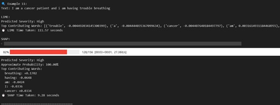

#### Retrieval-Augmented Generation (RAG)
- Embeds policy documents using **MiniLM-L6-v2**
- Indexed with **FAISS**
- Returns top-k policy chunks that support the claim decision
- Enables **grounded AI reasoning**, promoting compliance and trust


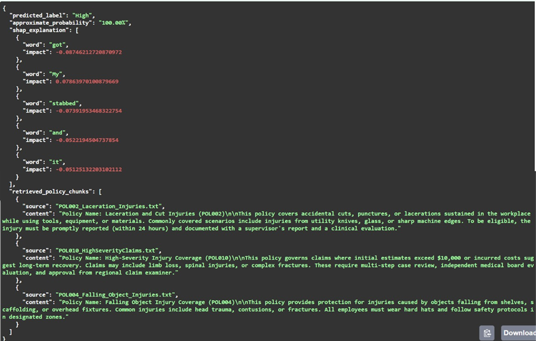

<br>

---

<br>


### 💻 UI Integration & Backend Infrastructure

#### FastAPI Backend + PostgreSQL
- All APIs served via **FastAPI**

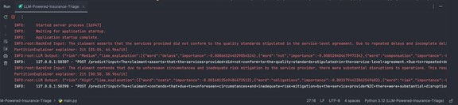

- Backend securely connected to a multi-user **PostgreSQL** database

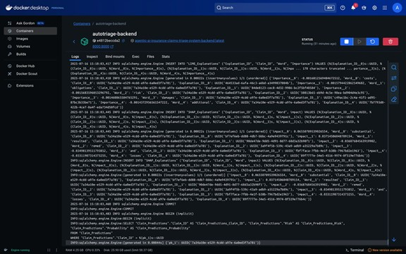

- OAuth2-based login system ensures access control
- Predictions and explanations stored with associated user IDs


#### Streamlit Frontend
- Fully integrated with backend services
- Functional prediction flow:
  1. Submit claim → `/predict` triggered

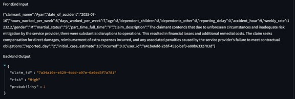

  2. Prediction + confidence shown
  3. Data logged in DB

- Interface enhanced for Phase 3 compatibility:
  - SHAP visual integration
  - RAG chunk display area

<br>

---

<br>


## Phase 3 – SHAP & LIME Integration | API Optimization | UI Visualization

### 🔍 Focus
Week 3 emphasized full-stack integration of model interpretability features using SHAP and LIME. This enhanced the explainability and transparency of the claims triage system for end-users.

### 🧠 AI/ML Backend Updates

- Optimized **SHAP** and **LIME** explanation APIs for seamless frontend integration  
- Introduced lightweight response formatting for efficient UI rendering  
- Reduced payload sizes and improved token-level explanation alignment  
- Implemented caching mechanisms for faster retrieval of explanation results  
- Improved error handling for unsupported claims, missing inputs, and version mismatches  
- Ensured consistent performance across SHAP, LIME, and RAG outputs  

**📊 Figure 1 – SHAP Integration with Frontend**  


**📊 Figure 2 – LIME Output in UI Context**


### 🎨 Frontend (Streamlit UI) Enhancements

- Integrated SHAP & LIME outputs into the **AI Explanation Page**  
- Visualized feature importance through **bar plots** and **token-level highlights**  
- Displayed retrieved policy clauses from the RAG pipeline alongside model confidence  
- Developed overlay views for complete decision traceability  
- Added robust fallback handling for API latency or missing explanation data  

**🖥️ Figure 3 – AI Explanation Page with SHAP, LIME & RAG Context**


### 🔧 Coming Next – Week 4: MLOps & DevOps Initiatives

Planned enhancements include:

#### MLOps
- Real-time model drift monitoring  
- Scheduled automated retraining  
- Model and dataset version control  
- ML experiment tracking with MLflow  

#### DevOps
- CI/CD pipeline setup via GitHub Actions  
- Secure containerized deployment (FastAPI + Streamlit)  
- Regular backups of models, datasets, and logs  
- Docker Compose orchestration with future Kubernetes support  
